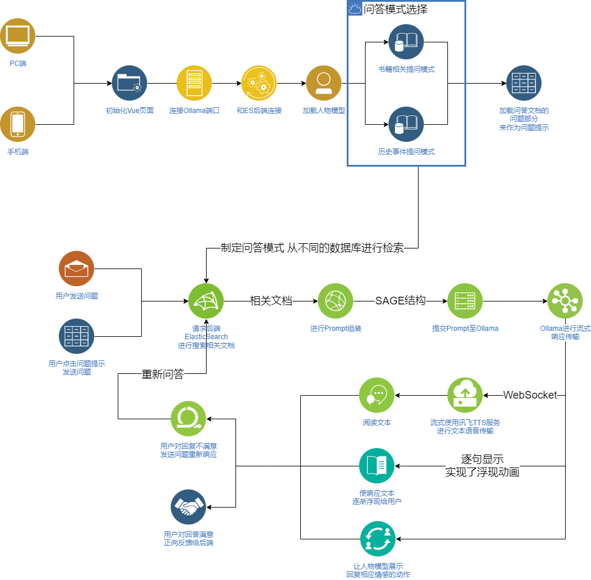

# Sagaciousist

- 首先，当用户访问时会判断为手机端还是电脑端并渲染不同的页面，然后连接必要的服务，例如进行响应的Ollama模型和检索问答文档的ElasticSearch后端，之后渲染人物模型，并做出欢迎动作来初始化。
- 随后让用户选择问答模式，可以选择书籍相关提问模式和历史事件提问模式，这两种模式分别对应了不同的数据库，后续将用于在请求ElasticSearch搜索问答文档时制定数据库。
- 之后显示一个模块，若用户对于本项目感到有新鲜感但不知道问什么，检索出三个问答文档中的问题显示给用户让用户尝试提问。
- 当用户发送问题时，首先将用户的问题提取关键词发送给ElasticSearch后端进行检索，返回几个相似度较高的内容然后进行组装Prompt，这里运用了SAGE提示词框架（由情况、行动、目标和预期组成）组装并发送给Ollama。
- 从Ollama选择流式传输获取响应内容从而保证响应的迅速性以避免用户等待时间过长，在流式获取内容的同时进行断句将每句内容发送给讯飞的TTS服务，通过WebSocket获取到音频后播放，文本和音频都有一个等待的队列，在当句的音频播放结束后让下一个等待的内容显示。
- 用户若对回复不满意，可以重新更改问题，并重新发送给ElasticSearch重新检索并重新发送给Ollama进行响应。
